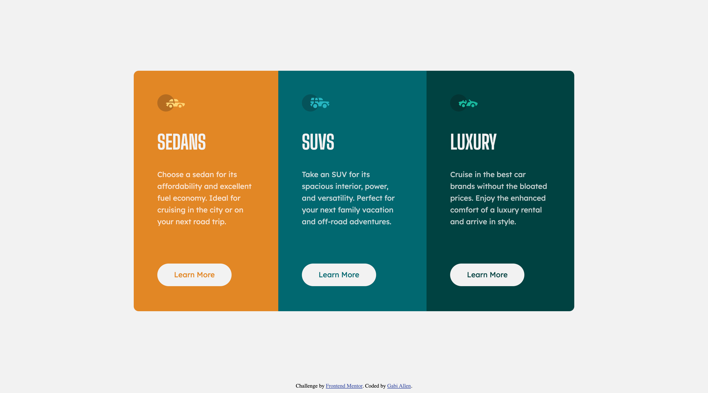

# Frontend Mentor - 3-column preview card component solution

This is a solution to the [3-column preview card component challenge on Frontend Mentor](https://www.frontendmentor.io/challenges/3column-preview-card-component-pH92eAR2-). Frontend Mentor challenges help you improve your coding skills by building realistic projects.

## Table of contents

- [Overview](#overview)
  - [The challenge](#the-challenge)
  - [Screenshot](#screenshot)
  - [Links](#links)
- [My process](#my-process)
  - [Built with](#built-with)
  - [What I learned](#what-i-learned)
  - [Useful resources](#useful-resources)
- [Author](#author)
- [Acknowledgments](#acknowledgments)

**Note: Delete this note and update the table of contents based on what sections you keep.**

## Overview

### The challenge

Users should be able to:

- View the optimal layout depending on their device's screen size
- See hover states for interactive elements

### Screenshot



### Links

- Solution URL: [My Solution](https://www.frontendmentor.io/solutions/3-card-preview-using-htmlcss-i1adNnWyG)
- Live Site URL: [My Site](https://gabiallen.github.io/3-column-preview-card-component/)

## My process

### Built with

- HTML
- CSS
- Flexbox
- Mobile and Desktop media types

### What I learned

```html
<main class="container">
  A container class can hold all content so that I can edit the margin and
  padding
</main>
```

```css
/* Mobile Only Styles */
@media (max-width: 768px) {
  .flex {
    flex-direction: column;
  }
```

### Useful resources

- [CSS Buttons](https://www.w3schools.com/css/css3_buttons.asp) - This taught me how to use pseudo-elements to make an element change on hover.
- [HTML Elements](https://developer.mozilla.org/en-US/docs/Web/HTML/Element) - This was useful to refer to when deciding what HTML tag I should use for each element.

## Author

- Website - [Gabi Allen](https://github.com/gabiallen)
- Frontend Mentor - [@gabiallen](https://www.frontendmentor.io/profile/gabiallen)

## Acknowledgments

This project was done for MEJO 187 (Introduction to Interactive Media taught by Andrew Sipes) at UNC-Chapel Hill.
